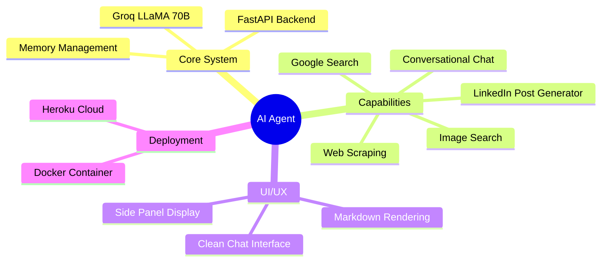
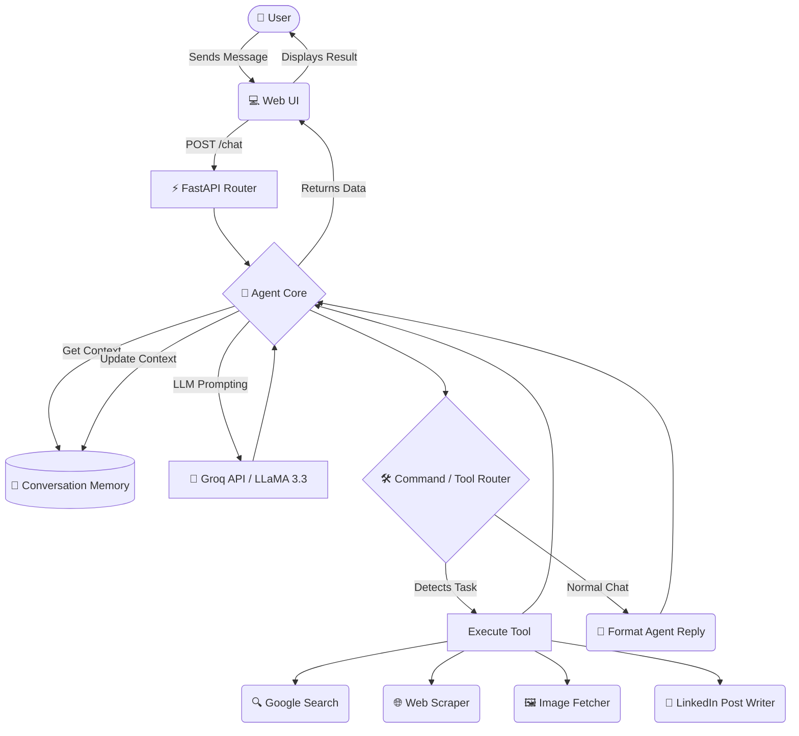

# 🤖 AI Agent — Conversational AI Assistant

A lightweight, production-ready conversational AI Agent powered by **Groq (LLaMA 3.3 70B)** and served via **FastAPI**.  
Features a clean, modern Chat UI with real-time messaging, memory across a session, and tool-routing architecture — all running as a local or cloud-hosted web app.

## 🧠 Project Mindmap



---

## 📁 Project Structure

```
ai-agent/
├── app/
│   ├── main.py             # FastAPI app — routes, HTML UI served here
│   ├── __init__.py
│   ├── core/
│   │   ├── agent.py        # Agent logic — runs chat loop, handles tool routing
│   │   ├── brain.py        # Groq LLM client — sends messages, gets completions
│   │   ├── config.py       # Loads environment variables (API key, model name)
│   │   ├── memory.py       # Conversation memory — stores chat history per session
│   │   └── __init_.py
│   ├── tools/
│   │   └── __init__.py     # Tool registry (extensible — add tools here)
│   └── static/
│       ├── styles.css      # Chat UI styling
│       └── agent-bg.png    # Background image for the UI
├── .env                    # Environment variables (API keys — NOT committed)
├── .gitignore
├── Procfile                # For Heroku/cloud deployment
├── requirements.txt        # Python dependencies
├── runtime.txt             # Python version (3.13.5)
└── README.md
```

---

## ⚙️ App Architecture & Flow (Infographic)



- **Brain** — wraps the Groq client; sends full conversation history each call  
- **Memory** — keeps chat history (system prompt + all USER/Assistant turns) for the session  
- **Agent** — controls the reasoning loop; supports tool-use command routing  
- **Tools** — extensible registry connecting the agent's brains with external APIs (DuckDuckGo, Jina, Playwright, etc.)

---

## 🚀 Getting Started

### 1. Prerequisites

- Python **3.10+** (project uses 3.13.5)
- A free **Groq API Key** → get one at [https://console.groq.com](https://console.groq.com)

---

### 2. Clone the Repository

```bash
git clone https://github.com/Banoth-Rajesham/AI-AGENT-PERSONAL_PROJECT.git
cd ai-agent
```

---

### 3. Create & Activate a Virtual Environment

**Windows (PowerShell):**
```powershell
python -m venv venv
.\venv\Scripts\Activate.ps1
```

**macOS / Linux:**
```bash
python -m venv venv
source venv/bin/activate
```

---

### 4. Install Dependencies

```bash
pip install -r requirements.txt
```

**Dependencies installed:**

| Package | Version | Purpose |
|---|---|---|
| `fastapi` | 0.127.0 | Web framework & API server |
| `uvicorn` | 0.22.0 | ASGI server to run FastAPI |
| `groq` | 1.0.0 | Groq LLM SDK (LLaMA 3.3 70B) |
| `python-dotenv` | 1.0.1 | Load `.env` config variables |
| `python-multipart` | 0.0.21 | Form data support |
| `httpx` | 0.28.1 | Async HTTP client |

---

### 5. Configure Environment Variables

Create a `.env` file in the project root (copy the example below):

```env
GROQ_API_KEY=your_groq_api_key_here
MODEL=llama-3.3-70b-versatile
```

> ⚠️ **Never commit your `.env` file** — it is listed in `.gitignore`.  
> Get your free API key at [https://console.groq.com](https://console.groq.com)

**Available Groq models you can use:**

| Model | Notes |
|---|---|
| `llama-3.3-70b-versatile` | ✅ Default — best quality |
| `llama-3.1-8b-instant` | Faster, lighter |
| `mixtral-8x7b-32768` | Long context window |

---

### 6. Run the Application (Local)

```powershell
uvicorn app.main:app --reload
```

Then open your browser at:

```
http://localhost:8000
```

The `--reload` flag auto-restarts the server when you change code — great for development.

---

### 7. API Endpoints

| Method | Endpoint | Description |
|---|---|---|
| `GET` | `/` | Serves the Chat UI (HTML page) |
| `POST` | `/chat` | Send a message; returns agent response |

**Example `/chat` request:**

```bash
curl -X POST http://localhost:8000/chat \
  -H "Content-Type: application/json" \
  -d '{"message": "Hello, who are you?"}'
```

**Response:**
```json
{
  "response": "Hey there! I'm your AI assistant — ask me anything! 😊"
}
```

---

## 🌐 Deploy to Heroku (Cloud)

A `Procfile` and `runtime.txt` are already included for Heroku deployment.

```bash
# Login and create app
heroku login
heroku create your-app-name

# Set environment variables on Heroku
heroku config:set GROQ_API_KEY=your_groq_api_key_here
heroku config:set MODEL=llama-3.3-70b-versatile

# Deploy
git push heroku main
```

The `Procfile` runs:
```
web: uvicorn app.main:app --host 0.0.0.0 --port $PORT
```

---

## 🔧 Extending the Agent (Adding Tools)

The agent already has a **tool-routing loop** built in. To add a new tool:

1. Create your tool function inside `app/tools/`
2. In `agent.py`, map the tool name to its function inside the `run()` loop
3. Update the system prompt in `agent.py` to tell the LLM when and how to use it

**Tool call format the LLM uses:**
```
USE_TOOL:tool_name:tool_input
```

Example tools you can add:
- 🌦️ Weather lookup
- 🕐 Current time/date
- 🔍 Web search (DuckDuckGo)
- 📖 Wikipedia summary

---

## 🛑 Common Issues & Fixes

| Issue | Fix |
|---|---|
| `GROQ_API_KEY not found` | Make sure `.env` file exists with the correct key |
| `ModuleNotFoundError` | Run `pip install -r requirements.txt` in your virtual env |
| Port already in use | Run `uvicorn app.main:app --reload --port 8001` |
| Venv not activating on Windows | Run `Set-ExecutionPolicy RemoteSigned` in PowerShell as Admin |

---

## 🧑‍💻 Tech Stack

| Layer | Technology |
|---|---|
| **Backend** | Python, FastAPI, Uvicorn |
| **LLM** | Groq API — LLaMA 3.3 70B Versatile |
| **Frontend** | Vanilla HTML, CSS, JavaScript (embedded in FastAPI) |
| **Icons** | Lucide Icons (CDN) |
| **Config** | python-dotenv |
| **Deployment** | Heroku-ready (Procfile + runtime.txt) |

---

## 📄 License

MIT License — free to use, modify, and distribute.

---

> Built with ❤️ by Rajesham Banoth
